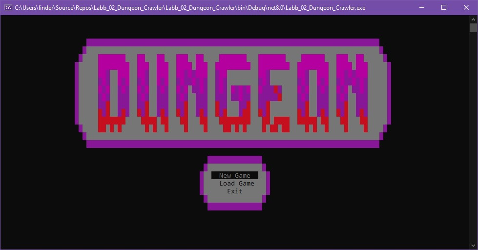
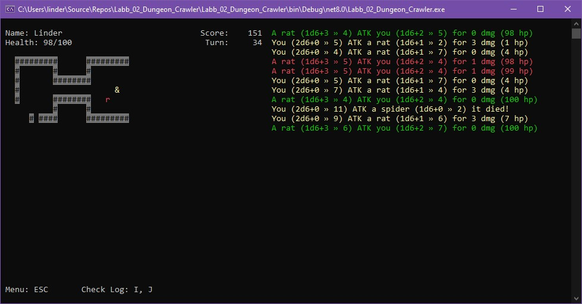
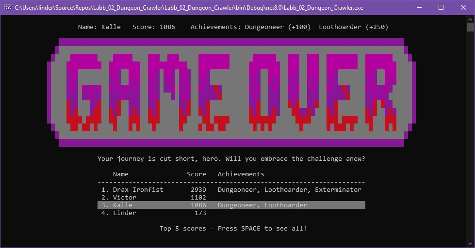

# Dungeon Crawler

## Setup Instructions
1. Download the repo
2. Change the connectionString and the databaseName in the top of program.cs to match your database.
3. Run the game!

# About

This was our second [assignment](ASSIGNMENT.md) in the course Programming with C# where we should make a dungeon crawler console game. Before this we had only worked on smaller algorithm stuff and this was sort of the first program that actually used several files. We got a lvl.txt file from our teacher that we got to learn how to read to the app and then build the app around.

I made a startscreen that made my app stand out a bit more and coded the menu function so it highlights the current choice.

Our teacher had inlcuded rats and snakes as enemies but I also added spiders. I also added some items to make it feel a bit more like a game. For example a tourch to make the players visability larger, a sword so you could deal more damage, healing pots etc.

When you surrender or die you get a "Game Over" message and if you win you get a "Triumph" message instead followed by a ranomized message. Then your score with your achievements get saved to the database.

When you start a new game, walk into a wall, picking up an item or finish the game there is a string array picking randomly between 10 different sentances to make the game feel not as repetetive. Which is quite fun even if the game only have one level and no real replay value.

# Version 2

In our next course about databases we got to pick an app and make it work with a database. I choose this app as I thought it would be a bigger challenge than our Quiz App that already saved everything as JSON. I then picked MongoDb with MongoDbDriver as the other database projects where using SQL and EntityFramework. In the first verison of the app I already saved highscore into a json-file, but to save the whole gamestate in the database was a bigger problem. But didn't take that much time and I'm overall pleased with the result for being my first "real" C# project.

---
Thanks for reading!
/Kristoffer Linder